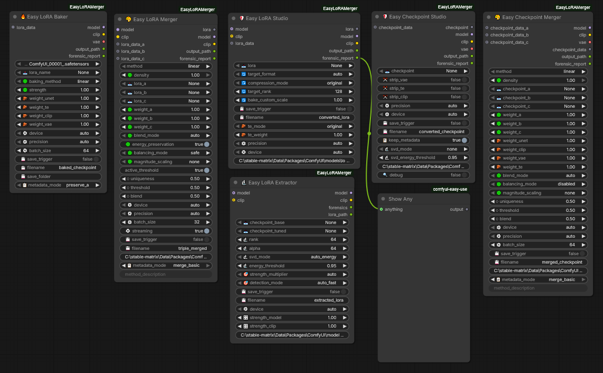

# 🛠️ Easy LoRA Merger Suite
*Complexity Made Simple — Merge Anything*

The Easy LoRA Merger Suite gives you a complete toolkit to merge, convert, extract, bake, and
audit LoRAs and checkpoints — without worrying about tensor dimensions, sparsity mismatches,
or arcane scaling math.

Every node is built with the same philosophy: **powerful defaults when you need simplicity,
full control when you need precision.**

---

# 🔍 All Nodes at a Glance

> The complete node suite — drag, connect, and merge.

---

# 📦 Node Catalog

| Node | Display Name | Purpose |
|------|-------------|---------|
| 🎨 | **Easy LoRA Merger** | Merge 2–3 LoRAs with 15+ methods, auto‑format detection, smart defaults, and forensic reports. The core workhorse. |
| 🛡️ | **Easy LoRA Studio** | Universal LoRA analyzer and converter. Transforms between Standard WebUI, Comfy Native, and Forge‑Optimized formats. SVD compression, TE scaling, weight adjustment. |
| 🛡️ | **Easy Checkpoint Studio** | Precision surgery for full checkpoints — precision casting FP8/BF16/FP32, component stripping VAE/TE/CLIP, SVD compression, and structural remapping. |
| 🎨 | **Easy Checkpoint Merger** | Merge 2–3 full model checkpoints with Weight Block Map component‑wise scaling. Streaming engine for low RAM usage. |
| 🔬 | **Easy LoRA Extractor** | Extract a LoRA from the delta between a base and fine‑tuned checkpoint. SVD decomposition with auto‑energy rank selection. |
| 🔧 | **Easy Component Extractor** | Split a checkpoint into its building blocks — extract UNet, CLIP, or VAE as separate files with precision control. |
| 🧩 | **Easy Component Combiner** | Reassemble extracted UNet + CLIP + VAE components back into a single full checkpoint. |
| 🧩 | **Easy Component Merger** | Merge 2–3 component state dicts (e.g., two different CLIP sets or UNets) using the full merge method suite. |
| 🔥 | **Easy LoRA Baker** | Bake a LoRA (or merged LoRA) directly into a full checkpoint at the tensor level. Produces MODEL+CLIP+VAE with RAM Guard fallback. |

---

# 🎯 Merge Methods

| Method | Best for | Works on Checkpoints? |
|--------|----------|:---------------------:|
| **linear** | Simple weighted average — the safe starting point for any merge | ✅ Yes |
| **cross** | Blending with a cross‑magnitude interaction term for richer mixes | ✅ Yes |
| **ties_strict** | Conflicting styles — only keeps weights where both sources agree | ⚠️ Limited (all-positive weights reduce effect) |
| **ties_gentle** | Softer version of TIES — applies only to strong disagreements | ⚠️ Limited (all-positive weights reduce effect) |
| **ties_contrast** | Amplify differences between two sources, mute agreements | ⚠️ Limited (best on LoRA deltas) |
| **dare_lite** | Random dropout — creates sparse, stochastic blends | ❌ LoRA only (risky on checkpoint weights) |
| **dare_rescale** | Random dropout with rescaling — preserves magnitude distribution | ❌ LoRA only (risky on checkpoint weights) |
| **magnitude** | Keep the stronger signal per-element from either source | ✅ Yes |
| **subtract** | Remove unwanted features by subtracting one source from another | ✅ Yes |
| **feature_mix** | Preserve unique features from each source — great for style + character | ✅ Yes |
| **slerp** | Smooth spherical interpolation between two vectors | ✅ Yes (2‑way only) |
| **svd_preserve** | SVD‑based rank reduction — keeps core structure while reducing noise | ✅ Yes |
| **block_swap** | Swap blocks between sources using a seeded random pattern | ✅ Yes |
| **noise_aware** | Suppress small noise values before merging for cleaner results | ✅ Yes |
| **gradient_alignment** | Weight contributions by directional similarity between sources | ✅ Yes |

> 💡 **Tip:** When in doubt, start with `linear` or `magnitude` — they're the most versatile and work well across LoRAs and checkpoints alike.

---

# 🧠 Smart Diagnostics

Every merge node outputs a detailed forensic report with:

- ✅ **Alignment verification** — cross‑architecture key matching stats
- 📊 **Layer‑by‑layer statistics** — energy distribution, sparsity, component breakdown
- ⚠️ **Clear warnings** — mismatched trainers, conflicting trigger words, density risks
- 🔍 **Sparsity + scaling reports** — magnitude distribution per layer

Console output keeps you informed at every step without overwhelming.

---

# 🏗️ Supported Architectures (aspirational — not all fully tested)

| Architecture | Status |
|-------------|--------|
| Flux.1‑Dev / Flux.1‑S | Tested |
| Flux Klein 4B / 9B | Tested |
| Z‑Image Turbo / Base | Tested |
| SDXL | Tested |
| SD1.5 | Tested |
| Anima | Early support |
| Lumina 2 | Early support |
| SD3 | Experimental |

---

# 🚀 Get Started

- **Download:** [github.com/Terpentinas/EasyLoRAMerger](https://github.com/Terpentinas/EasyLoRAMerger)
- **Install:** Drop into `ComfyUI/custom_nodes/` and restart ComfyUI.
- **Explore:** Drag [`assets/nodes.png`](assets/nodes.png) into the workflow area to see the suite in action.
- **Experiment:** Connect a *Easy LoRA Merger* → *Easy LoRA Baker* pipeline, or use *Easy Checkpoint Studio* to shrink a 12GB checkpoint to FP8.
- **Optional — GGUF export:** Install `pip install gguf` to enable GGUF output format in Easy Checkpoint Studio. GGUF files are loaded with the [ComfyUI-GGUF](https://github.com/city96/ComfyUI-GGUF) custom node. All other Easy LoRA Merger nodes work without either dependency.
- **Feedback:** Open an issue on GitHub — contributions and ideas welcome.

---

# ⚙️ Precision Options

Different nodes expose different precision tiers depending on their capabilities:

### Standard Tier — all float formats
Used by: **Easy LoRA Merger**, **Easy LoRA Studio**

| Option | Behavior |
|--------|----------|
| `auto` | Auto-select — defaults to BF16 on supported GPUs |
| `float32` | Full precision, 4 bytes/param — maximum quality |
| `bfloat16` | Half precision, 2 bytes/param — good balance |
| `float16` | Half precision, 2 bytes/param — good balance |

### Extended Tier — adds FP8 support
Used by: **Easy Checkpoint Merger**, **Easy Component Extractor**, **Easy Component Combiner**, **Easy Component Merger**, **Easy LoRA Baker**

| Option | Behavior |
|--------|----------|
| *(all Standard options above)* | |
| `fp8_e4m3fn` | FP8 quantization, 1 byte/param — memory efficient |
| `fp8_e5m2` | FP8 quantization (wider range) — memory efficient |

### Studio Tier — full conversion toolkit
Used by: **Easy Checkpoint Studio**

| Option | Behavior |
|--------|----------|
| *(all Extended options above)* | |
| `int8` | Explicit INT8 quantization, 1 byte/param |
| `int8_convrot` | INT8 with convolution rotation handling |
| `svd_only` | SVD compression only, no dtype conversion |
| `gguf_q8_0` / `gguf_q5_0` / `gguf_q4_0` | Block‑wise GGUF quantization — requires `gguf` Python package (`pip install gguf`). Output loads with [ComfyUI-GGUF](https://github.com/city96/ComfyUI-GGUF) nodes. |

> 💡 **Tip:** For everyday use, just leave it on `auto`. The nodes will pick the best format for your hardware automatically.
>
> ⚠️ **Note:** The `gguf` package is **optional**. All nodes work without it — GGUF output is only available in Easy Checkpoint Studio when `gguf` is installed. If missing, GGUF options are hidden from the dropdown and the Checkpoint Studio loads gracefully without them.

---

# 📐 Design Philosophy

The suite is engineered for stability and SSD-friendly operation:

- **No unnecessary disk writes** — intermediate data stays in RAM. Temp files are created only when RAM Guard activates or `save_trigger=True`.
- **Clean resource management** — file handles from checkpoint loading are closed immediately after model objects are constructed, preventing stale handles from causing I/O during garbage collection.
- **Predictable performance** — no background cleanup threads. All file I/O is explicit and happens at known points in the pipeline.
- **Memory-efficient streaming** — large checkpoints are processed in configurable batch sizes, keeping peak RAM usage under control.

---

# 💾 Saving Your Merged Models

Every node with save capability exposes three controls: **`save_trigger`**, **`save_folder`**, and **`filename`**.

### How `save_trigger` Works

| Toggle | Behavior |
|--------|----------|
| `False` (default) | **Preview mode** — merge runs, MODEL+CLIP+VAE outputs are returned for testing, but **no file is written to disk**. |
| `True` | **Save mode** — result is written to a `.safetensors` file, then loaded from that file (or RAM) for downstream use. |

> 💡 Start with `save_trigger=False` to test your merge settings. Toggle it to `True` only when you're happy with the result.

### Save Locations

- **Checkpoint nodes** (Checkpoint Merger, Baker) → `ComfyUI/models/checkpoints/`
- **LoRA nodes** (LoRA Merger, LoRA Studio) → `ComfyUI/models/loras/`

You can override the location with `save_folder`:

| `save_folder` value | Example | Where it saves |
|--------------------|---------|---------------|
| Empty | `""` | ComfyUI default folder |
| Relative path | `"my_merges"` | `default/my_merges/merged.safetensors` |
| Absolute path | `"D:\\ModelMerges"` | `D:/ModelMerges/merged.safetensors` |

### Filename & Auto-Increment

The `filename` parameter sets the output name (`.safetensors` is appended automatically).

If a file with that name already exists, most nodes auto-increment:
- `merged_checkpoint` → `merged_checkpoint_1` → `merged_checkpoint_2` ...
- `triple_merged` → `triple_merged_1` → `triple_merged_2` ...

> ℹ️ **Studio & Converter nodes** (Checkpoint Studio, LoRA Studio) add `_converted` before the extension: `name_converted.safetensors`, `name_converted_1.safetensors`.

---

# ⚖️ Weight Guidance

The **global weights** (`weight_a`, `weight_b`, `weight_c`) multiply with **component weights** (`weight_unet`, `weight_clip`, `weight_vae`, `weight_te`) to determine the effective strength per component.

### Key Insight: Checkpoints vs LoRAs

| Type | What the weights multiply | Guidance |
|------|--------------------------|----------|
| **Checkpoints** | Absolute weight values (large, ~1.0 scale) | **For `linear`**: weights should sum close to 1.0 (e.g., `0.5 + 0.5`, `0.7 + 0.3`). With `1.0 + 1.0` the output becomes `A + B` — doubling magnitudes, resulting in noise. |
| **LoRAs** | Small delta values (≈1e‑3 scale) | Weights are independent — feel free to experiment. LoRAs are fast to iterate on. |

### General Approach

1. **Start with equal weights** — `0.5 + 0.5` for checkpoints, `1.0 + 1.0` for LoRAs.
2. **Use `save_trigger=False`** (preview mode) to test without cluttering your disk.
3. **Adjust one weight at a time** — small increments (0.05–0.1) and see how the output changes.
4. **Different architectures** (Flux, SDXL, SD1.5, Z‑Image) may respond differently to the same weights — trust your eyes.

### Per-Method Notes

| Method | Weight behavior |
|--------|---------------|
| **`linear`** | Direct weighted sum. For checkpoints: `result = A×wa + B×wb` — sum should be ≈1.0. For LoRAs: any values work. |
| **`feature_mix`** | Preserves unique features per-element. `1.0 + 1.0` is fine — not additive. |
| **`magnitude`** | Takes the larger signal per-element from either source. `1.0 + 1.0` is fine. |
| **`slerp`** | Uses `\|weight\|` as interpolation factor. Sign is discarded. |
| **`subtract`** | `wa` controls source strength, `wb` controls how much of B to remove. |
| **`ties_*`** | Sign-based. Limited effect on all-positive checkpoint weights. |
| **`dare_*`** | Uses `density` for sparsification, not weight sum. Risky on checkpoints. |

> 💡 **The best weights depend on your models and goal.** These are starting points, not rules. The suite is designed for exploration — iterate and find what works for your specific combination.

---

*Built because merging different model formats shouldn't require a PhD in tensor math.* 💪
