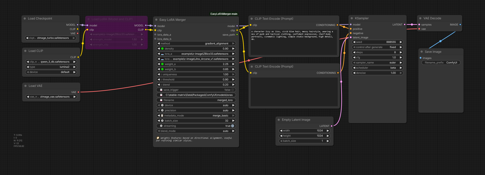
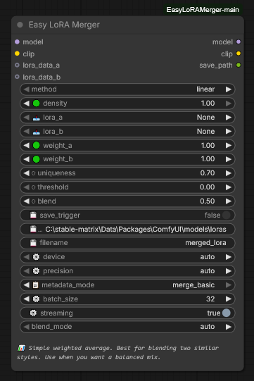
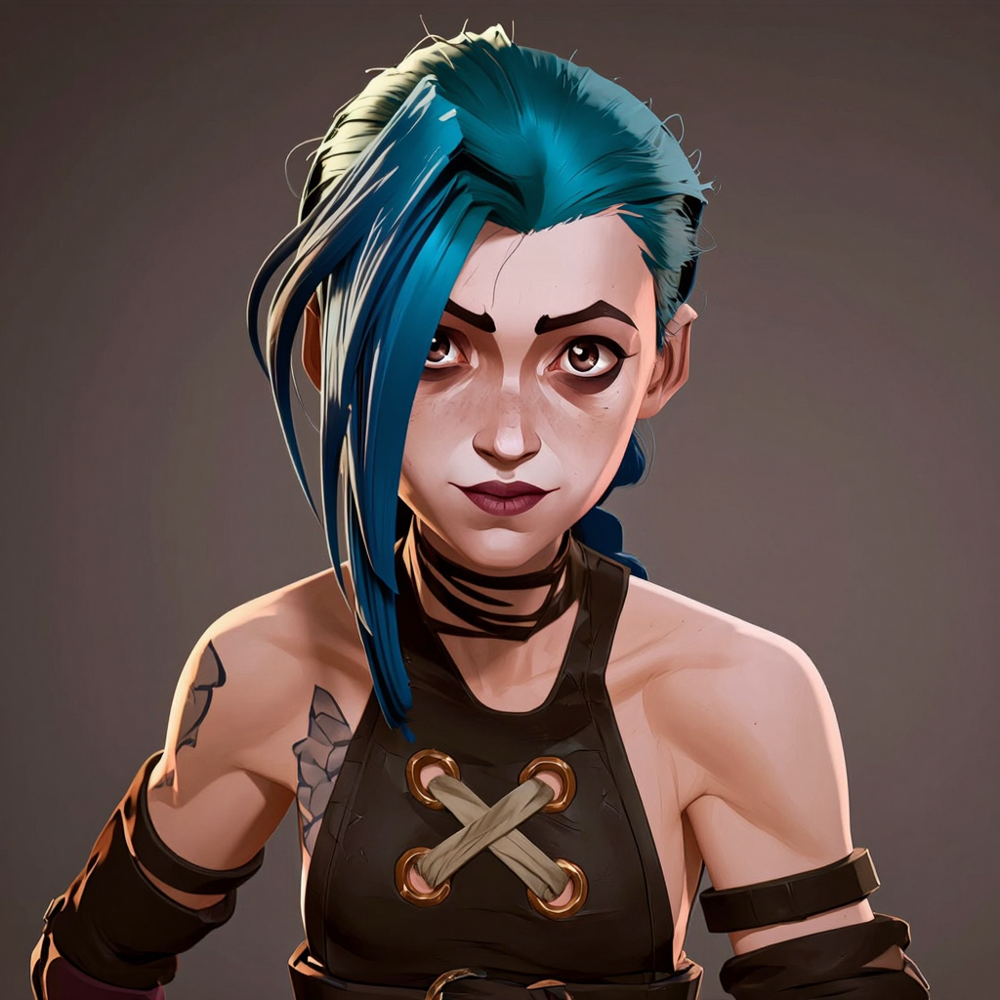
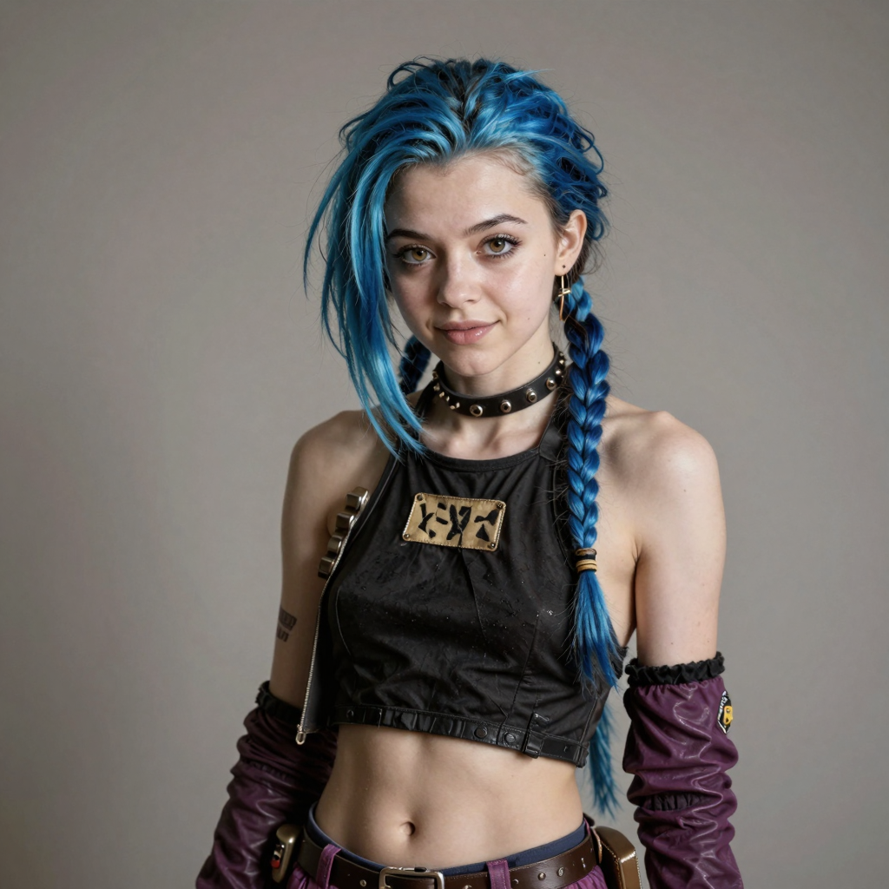
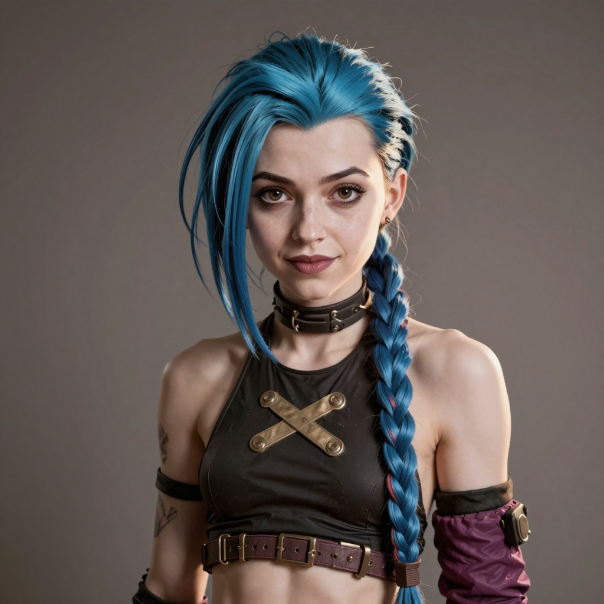
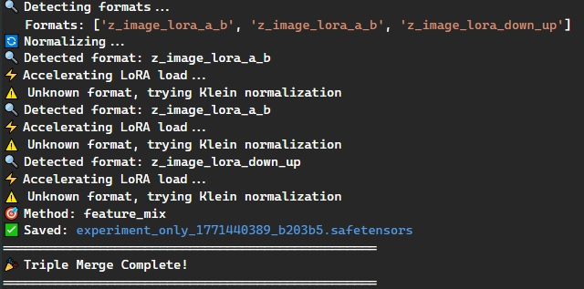

# 🛠️ Easy LoRA Merger  
*Complexity Made Simple*

Models are evolving fast — between Z-Image, Klein 4B/9B, Flux 2 Dev, and SDXL, it's a lot to keep track of.  
This suite of nodes lets you merge different architectures without worrying about tensor dimensions, sparsity mismatches, or scaling math.

The goal isn’t to be the most complex tool — it’s to be the most helpful.

---

# 🔍 Example Workflow

This is the basic "Identity Hybrid" setup used in the examples below.

> Drag the workflow image into ComfyUI to load it instantly.

---

# 🧠 Main Node Interface

The core node with blend modes, diagnostics, and merge methods.

Includes:
- Blend mode selection
- Advanced merge methods
- Fun Mode toggles
- Layer-by-layer diagnostics
- Compatibility checks

---

# 🧪 Identity Blending Example

### Source LoRAs

| LoRA A | LoRA B |
|--------|--------|
|  |  |

### Merged Result

By carefully balancing weights, both identities remain visible without overpowering each other.

Tested With:
- ✅ Z-Image (Turbo + Base Mix)
- ✅ Flux Klein 9B Character Blends
- ✅ SDXL Style + Character Mixes

---

# 🎮 Blend Modes

| Mode | Description |
|------|-------------|
| **auto** | Smart selection based on sparsity patterns |
| **balanced** | Preserves unique activation structure (great for mixed trainers) |
| **dense** | Traditional dense tensor blending |
| **fun_mode** | Experimental math for creative effects |

---

## 🎲 Fun Mode Effects by Method

| Method | Fun Mode Effect |
|--------|-----------------|
| magnitude | "chaos mode" – Random weighted selection |
| subtract | "glitch mode" – Random add/subtract behavior |
| dare_lite | "gambler mode" – Random amplification |
| ties_strict | "disagreement mode" – Keeps opposing tensor signs |
| ties_gentle | "drama mode" – Amplifies disagreements |
| dare_rescale | "lottery mode" – Random jackpot scaling |
| svd_preserve | "patchwork mode" – Block-based swapping |
| noise_aware | "static mode" – Structured noise injection |
| gradient_alignment | "mood swing mode" – Random alignment bias |

---

# 📦 Node Toolbox

- **Easy LoRA Merger** — Main engine for merging and previewing
- **Easy LoRA-Only Merger** — Clean chaining of multiple merges
- **🎨 Triple Merger (Experimental)** — Character + outfit + style in one pass
- **🔄 Musubi LoRA Converter** — Compatibility bridge for Musubi-trained LoRAs
- **🔄 Z-Image Normalizer** — Fix weight imbalance between Turbo and Base
- **🔥 Base Model Baker (Experimental)** — Bake merged LoRA directly into model

---

# 📝 Smart Diagnostics

Console output includes:

- ✅ Alignment verification
- 📊 Layer-by-layer statistics
- ⚠️ Clear warnings for mismatches
- 🔍 Sparsity + scaling reports

---

# 🧪 Resources Used in Examples

These are the LoRAs used in the demonstration images above.

- **Jinx Arcane (Z-Image Turbo)** by Tekemo — [https://civitai.com/models/2198444/jinx-arcane-z-image-turbo-lora?modelVersionId=2475322]
- **Izzy AI Character (Flux 2)** by berts_eyebrow — [https://civitai.com/models/2194957/izzy-ai-character-flux2-9b-qwen-2512-z-image-xl-wan?modelVersionId=2650293]

---

# 🚧 Beta Status – Feedback Wanted

Looking for:

- **Flux 2 Dev testers**
- **24GB+ VRAM users** to test baking 9B models
- **SDXL users** to try style + character merges

---

# 🚀 Get Started

- Download: https://github.com/Terpentinas/EasyLoRAMerger
- Load workflow into ComfyUI
- Experiment with blend modes
- Open an issue for feedback

---

*Built because merging different LoRA formats shouldn’t require a PhD in tensor math.* 💪